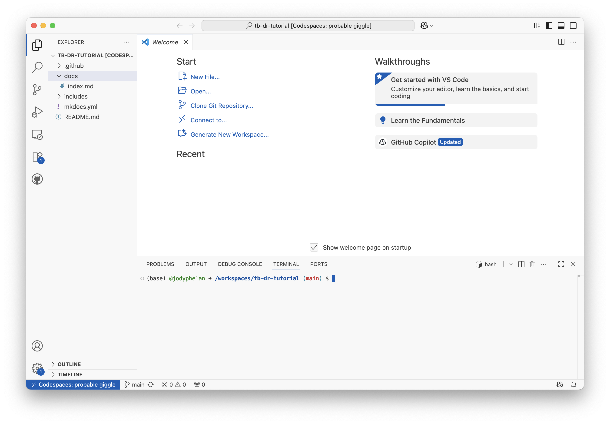
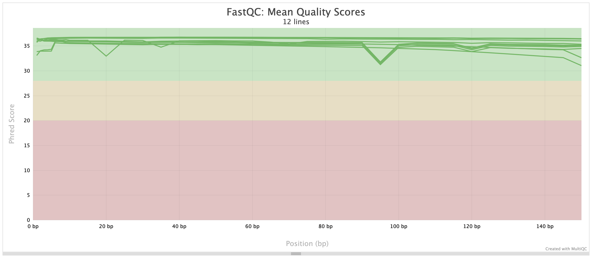

# TB Drug resistance tutorial

## Learing objectives

* Asses the quality of raw sequence data
* Determine the genetic resistance profiles of TB samples using TB-Profiler

## Introduction

In this tutorial, we will learn how to assess the quality of raw sequence data and determine the genetic resistance profiles of TB samples using TB-Profiler. We will be analysing data that was generated for a study that aimed to investigate the genetic diversity of TB strains the Phillipines: [Whole genome sequencing analysis of Mycobacterium tuberculosis reveals circulating strain types and drug-resistance mutations in the Philippines](https://pubmed.ncbi.nlm.nih.gov/39179783/).

## Setting up the environment

These tools are written in different programming languages and have different dependencies and require a unix operating system to run. There are several options to set up the environment:
    * Install the tools on your local machine
    * Use a cloud-based platform such as AWS or Google Cloud to create a virtual machine
    * Use a containerisation platform such as Docker or Singularity


### Installing the tools on your local machine

!!! danger "Windows"    
    This tutorial assumes that you are using a unix operating system. If you are on windows, you will first need to set up wsl on your machine. You can follow the instructions [here](https://docs.microsoft.com/en-us/windows/wsl/install-win10). Following this,
    you will have access to a unix terminal and can follow the instructions below.

We will be using a conda environment to manage these dependencies. If you don't have conda installed, you can follow the instructions [here](https://conda-forge.org/download/).

### Using GitHub Codespaces

If you don't want to install the tools on your local machine, you can use GitHub Codespaces to create a cloud-based virtual machine. This will allow you to run the tools in a unix environment without having to install anything on your local machine. You'll need to have a GitHub account to use this service.

####  GitHub Codespaces

GitHub Codespaces is a cloud-based development environment that allows users to run and edit code directly in a virtual machine (VM) hosted by GitHub. It provides a fully configured workspace, pre-installed with necessary tools like Git, Python, and Docker, eliminating the need for users to set up a local environment. Every GitHub user has a certain number of free Codespace hours per month (120 for a free account), making it an ideal solution for doing some occasional bioinformatics. 

#### Visual Studio Code (VS Code)

VS Code is a lightweight yet powerful code editor that supports multiple programming languages. It also allows users to connect to GitHub Codespaces, allowing users to work on cloud-based VMs as if they were local files.
Users will launch GitHub Codespaces via VS Code, enabling them to interact with their virtual machine through a familiar coding interface.


#### How These Work Together:

1. Users launch GitHub Codespaces to create a cloud-based virtual machine.
2. They connect to the VM using VS Code, accessing the terminal and code files.

This setup allows users to work on cloud-hosted projects with both command-line and GUI access, making it ideal for bioinformatics and data analysis workflows.


### Getting set up

#### 1. Set up a GitHub account

Head over to https://github.com/ and sign up for an account. You can skip this step if you already have an account.

#### 2. Download Visual Studio Code

Get the latest version of vscode from https://code.visualstudio.com/ and follow install instructions from the website.

#### 4. Get connected

Once you have installed VScode, you can connect to your GitHub Codespace using the following steps:

1. Open Visual Studio Code.
2. Install the GitHub Codespaces extension by clicking on the following link and following instructions: [GitHub Codespaces](https://marketplace.visualstudio.com/items?itemName=GitHub.codespaces).
3. Open the command palette by pressing `Ctrl+Shift+P` (Windows/Linux) or `Cmd+Shift+P` (Mac).
4. Type `Create new Codespace` and select the option.
5. Enter `jodyphelan/tb-dr-tutorial` in the repository field.
6. You will then be proppted to select a branch. You should select the `main` branch.
7. You will be asked what type of instance to create. Select `4 cores, 16GB RAM, 32 GB storage` option.

It should take a few minutes to create the Codespace. Once it's ready, you will be able to access the terminal and files directly from VS Code.

You should see something like this:



If you can't see the terminal, you can open it by clicking on `Terminal` in the top menu and selecting `New Terminal`.


## Set up bioinformatics software

Before we start, we need to set up the environment. We will be using the following tools:

* FastQC
* MultiQC
* TB-Profiler
* fastq-dl

We can install these software using a tool called `conda`. Conda is an open-source package management system and environment management system that runs on Windows, macOS, and Linux. Conda quickly installs, runs, and updates packages and their dependencies. Conda easily creates, saves, loads, and switches between environments on your local computer. It was created for Python programs, but it can package and distribute software for any language.

Conda should already be installed in your Codespace. You can check this by running the following command:

```bash
conda --version
```

If you see a version number, then conda is installed. If not, you can install it by following the instructions [here](https://conda.io/projects/conda/en/latest/user-guide/install/index.html). Before we start installing tools, you'll need to initialise conda by running the following command:

### Conda initialisation 

Before we start installing tools, you'll need to initialise conda by running the following command:

```bash
conda init
source ~/.bashrc
```

This will initialise conda to be loaded every time you open a new terminal. Next we need to add software channels so that conda can find the tools we want to install. Channels are the locations where packages are stored. Conda packages are downloaded from remote channels, which are URLs to directories containing conda packages. The [bioconda](https://bioconda.github.io/) channel contains bioinformatics software and the conda-forge channel contains a wide range of software packages. Use the following command to add the bioconda and conda-forge channels:

```bash
conda config --add channels bioconda
conda config --add channels conda-forge
conda config --set channel_priority strict
``` 

The actions above only need to be done once, so you won't need to run these commands again. 

### Create a new conda environment

Conda environments allow you to create isolated environments that have their own set of software installed. This is useful when you have different projects that require different versions of software. We will create a new conda environment called `tb` and install the required software in this environment. You can create a new conda environment by running the following command:

```bash
conda create -y -n tb fastqc multiqc tb-profiler fastq-dl
```

This step might take a few minutes (once you see `➜ /workspaces/tb-dr-tutorial (main) $` again you'll be ready to continue). 

This command will create a new conda environment called `tb` and install the required software. You can activate the environment by running the following command:

```bash
conda activate tb
```

You should see `(tb)` at the beginning of your terminal prompt, indicating that the `tb` environment is active.

### Download the data

We will be using data from the study [Whole genome sequencing analysis of Mycobacterium tuberculosis reveals circulating strain types and drug-resistance mutations in the Philippines](https://pubmed.ncbi.nlm.nih.gov/39179783/). The data is available on the European Nucleotide Archive (ENA) under the accession number [PRJEB37886](https://www.ebi.ac.uk/ena/browser/view/PRJEB37886). We will be downloading the data using the `fastq-dl` tool. You can download the data by running the following command:

```bash
fastq-dl -o data -a ERR6635398
fastq-dl -o data -a ERR6635159
fastq-dl -o data -a ERR6635124
fastq-dl -o data -a ERR6635248
fastq-dl -o data -a ERR6635174
fastq-dl -o data -a ERR6634973
```

This will download the raw sequence data for the samples with the accession numbers `ERR6635398`, `ERR6635159`, `ERR6635124`, `ERR6635248`, `ERR6635174`, and `ERR6634973` to a directory called `data`.

### Assess the quality of the raw sequence data

Before we start analysing the data, it's a good idea to assess the quality of the raw sequence data. We can do this using the `fastqc` tool. You can run `fastqc` on the raw sequence data by running the following command:

```bash
fastqc data/*.fastq.gz
```

This will generate a report for each of the raw sequence data files. We will then combine the reports into a single report using the `multiqc` tool. You can run `multiqc` on the `fastqc` reports by running the following command:

```bash
multiqc .
```

This will generate a report called `multiqc_report.html` that summarises the quality of the raw sequence data. You can open this on a web browser to view the report. Remember, if you are running this on a cloud-based platform, you will need to download the report to view it. You can download it by locating the file in the file explorer on the left-hand side of VS Code, right-clicking on the file, and selecting `Download`.


There are a few things that are important to look out for in the `fastqc/multiqc` reports, but the one you'll probably want to look at is the per base sequence quality. This shows the quality of the bases at each position in the read. You want to see a high quality score (green) across most positions. It may be normal to see a drop in quality towards the end of the read.

[]
    


### Determine the genetic resistance profiles of TB samples

Now that we have assessed the quality of the raw sequence data, we can determine the genetic resistance profiles of the TB samples using TB-Profiler. TB-Profiler is a tool that identifies genetic mutations associated with drug resistance in TB samples. You can run TB-Profiler on the raw sequence data by running the following commands:

```bash
tb-profiler profile -1 data/ERR6635398_1.fastq.gz -2 data/ERR6635398_2.fastq.gz  -p ERR6635398 --snp_dist 100  -t 4 --txt
tb-profiler profile -1 data/ERR6635159_1.fastq.gz -2 data/ERR6635159_2.fastq.gz  -p ERR6635159 --snp_dist 100  -t 4 --txt
tb-profiler profile -1 data/ERR6635124_1.fastq.gz -2 data/ERR6635124_2.fastq.gz  -p ERR6635124 --snp_dist 100  -t 4 --txt
tb-profiler profile -1 data/ERR6635248_1.fastq.gz -2 data/ERR6635248_2.fastq.gz  -p ERR6635248 --snp_dist 100  -t 4 --txt
tb-profiler profile -1 data/ERR6635174_1.fastq.gz -2 data/ERR6635174_2.fastq.gz  -p ERR6635174 --snp_dist 100  -t 4 --txt
tb-profiler profile -1 data/ERR6634973_1.fastq.gz -2 data/ERR6634973_2.fastq.gz  -p ERR6634973 --snp_dist 100  -t 4 --txt
```

These commands may take a long time to run! This will run TB-Profiler on each of the raw sequence data files and generate a report for each sample. The reports will contain information about the genetic resistance profiles of the samples. You can open the reports in a text editor to view the results. Specific parameters are used to specify the location of the raw sequence data files (`-1` and `-2`), the output prefix (`-p`), the SNP distance to use when performing clustering (`--snp_dist`), and the number of threads (`-t`). The `--txt` option is used to generate a text report.

Take a look at one of the reports to see the results. The report will contain information about the genetic resistance profiles of the sample, including the mutations identified and their associated drug resistance. Here we will go through the sections of the report for sample `ERR6635398`:

```
Summary
-------
ID: ERR6635398
Date: 2025-09-18 22:51:00.361166
Strain: lineage4.3.4.1
Drug-resistance: Pre-XDR-TB
Median Depth: 112.0
```

This section contains a summary of the sample, including the sample ID, date of analysis, strain lineage, drug resistance profile, and median depth of coverage.

```
Lineage report
--------------
Lineage	Fraction	Family	Rd
lineage4	100.000	Euro-American	None
lineage4.3	100.000	Euro-American (LAM)	None
lineage4.3.4	100.000	Euro-American (LAM)	RD174
lineage4.3.4.1	100.000	Euro-American (LAM)	RD174
```

This section contains information about the lineage of the sample, including the lineage, the estimated fraction of the lineage and any associated family names. The Lineage system is hierarchical, so you can see the lineage broken down into sub-lineages.

```
Resistance report
-----------------
Drug	Genotypic Resistance	Mechanisms
Rifampicin	R	rpoB p.Ser450Leu (1.00)
Isoniazid	R	katG p.Ser315Thr (1.00)
Ethambutol	R	embB p.Met306Val (1.00)
Pyrazinamide	R	pncA p.Leu172Pro (1.00)
Moxifloxacin	R	gyrA p.Asp94Asn (1.00)
Levofloxacin	R	gyrA p.Asp94Asn (1.00)
Bedaquiline		
Delamanid		
Pretomanid		
Linezolid		
Streptomycin	R	rrs n.514A>C (1.00)
Amikacin	R	rrs n.1401A>G (1.00)
Kanamycin	R	rrs n.1401A>G (1.00)
Capreomycin	R	rrs n.1401A>G (1.00)
Clofazimine		
Ethionamide		
Para-aminosalicylic_acid		
Cycloserine
```

This section contains information about the drug resistance profile of the sample, including the drugs tested for, the genotypic resistance (R = resistant, blank = no resistance identified), and the mutation identified (frequency of mutation in parentheses).

```
Resistance variants report
-----------------
Genome Position	Locus Tag	Gene Name	Variant Type	Change	Depth	Estimated Fraction	Drug	Confidence	Comment
7581	Rv0006	gyrA	missense_variant	p.Asp94Asn	58	1.000	moxifloxacin,levofloxacin	Assoc w R	,High-level resistance
761155	Rv0667	rpoB	missense_variant	p.Ser450Leu	66	1.000	rifampicin	Assoc w R	
1472359	EBG00000313325	rrs	non_coding_transcript_exon_variant	n.514A>C	82	1.000	streptomycin	Assoc w R	
1473246	EBG00000313325	rrs	non_coding_transcript_exon_variant	n.1401A>G	85	1.000	capreomycin,amikacin,kanamycin	Assoc w R	
2155168	Rv1908c	katG	missense_variant	p.Ser315Thr	111	1.000	isoniazid	Assoc w R	High-level resistance
2288727	Rv2043c	pncA	missense_variant	p.Leu172Pro	55	1.000	pyrazinamide	Assoc w R	
4247429	Rv3795	embB	missense_variant	p.Met306Val	86	1.000	ethambutol	Assoc w R
```

This section contains information about the specific mutations identified in the sample, including the genome position, gene name, type of variant, change, depth of coverage, estimated fraction of the mutation, associated drug, WHO confidence level, and any comments.

```
Other variants report
---------------------
Genome Position	Locus Tag	Gene Name	Variant Type	Change	Depth	Estimated Fraction	Gene Associated Drug	Confidence	Comment
7362	Rv0006	gyrA	missense_variant	p.Glu21Gln	77	1.000	moxifloxacin,levofloxacin	Not assoc w R	
7585	Rv0006	gyrA	missense_variant	p.Ser95Thr	61	1.000	moxifloxacin,levofloxacin	Not assoc w R	
9304	Rv0006	gyrA	missense_variant	p.Gly668Asp	75	1.000	moxifloxacin,levofloxacin	Not assoc w R	
576375	Rv0486	mshA	missense_variant	p.Ala343Val	55	1.000	isoniazid,ethionamide	Uncertain significance	
761496	Rv0667	rpoB	missense_variant	p.Tyr564His	84	0.988	rifampicin	Uncertain significance	
762506	Rv0667	rpoB	synonymous_variant	c.2700C>T	77	0.974	rifampicin	Not assoc w R - Interim	
764995	Rv0668	rpoC	synonymous_variant	c.1626C>G	114	1.000	rifampicin	Not assoc w R	
775639	Rv0676c	mmpL5	missense_variant	p.Ile948Val	86	1.000	bedaquiline,clofazimine	Not assoc w R - Interim,Not assoc w R	
781395	Rv0682	rpsL	upstream_gene_variant	c.-165T>C	109	1.000	streptomycin	Not assoc w R	
1364434	Rv1221	sigE	missense_variant	p.Arg8Trp	119	1.000	pyrazinamide	Not assoc w R	
1471659	EBG00000313325	rrs	upstream_gene_variant	n.-187C>T	100	1.000	capreomycin,amikacin,kanamycin,streptomycin	Uncertain significance	Not found in WHO catalogue
1854300	Rv1644	tsnR	missense_variant	p.Leu232Pro	46	1.000	linezolid	Not assoc w R	
1917972	Rv1694	tlyA	synonymous_variant	c.33A>G	52	1.000	capreomycin	Not assoc w R	
2223293	Rv1979c	Rv1979c	upstream_gene_variant	c.-129A>G	79	1.000	bedaquiline,clofazimine	Not assoc w R - Interim,Not assoc w R	
2726323	Rv2428	ahpC	missense_variant	p.Pro44Arg	90	1.000	isoniazid	Uncertain significance	
3073868	Rv2764c	thyA	missense_variant	p.Thr202Ala	116	1.000	para-aminosalicylic_acid	Uncertain significance	Not found in WHO catalogue
3086788	Rv2780	ald	upstream_gene_variant	c.-32T>C	172	1.000	cycloserine	Uncertain significance	Not found in WHO catalogue
3339496	Rv2983	fbiD	missense_variant	p.Glu127Gln	56	0.982	delamanid,pretomanid,clofazimine	Uncertain significance	Not found in WHO catalogue
3612009	Rv3236c	Rv3236c	missense_variant	p.Ala370Thr	60	1.000	pyrazinamide	Not assoc w R	
3625065	Rv3245c	mtrB	missense_variant	p.Met517Leu	83	1.000	rifampicin,bedaquiline	Uncertain significance,Not assoc w R	
4038287	Rv3596c	clpC1	synonymous_variant	c.2418C>T	78	1.000	pyrazinamide	Not assoc w R	
4242643	Rv3793	embC	synonymous_variant	c.2781C>T	48	1.000	ethambutol	Not assoc w R	
4247910	Rv3795	embB	missense_variant	p.Leu466Ser	67	1.000	ethambutol	Uncertain significance	
4338595	Rv3862c	whiB6	upstream_gene_variant	c.-75delG	94	1.000	capreomycin,amikacin,kanamycin	Not assoc w R	
4338732	Rv3862c	whiB6	upstream_gene_variant	c.-211C>T	148	1.000	capreomycin,amikacin,kanamycin	Uncertain significance	Not found in WHO catalogue
4408156	Rv3919c	gid	missense_variant	p.Leu16Arg	79	1.000	streptomycin	Not assoc w R
```

This section contains information about other mutations identified in the sample that are not associated with drug resistance, including the genome position, gene name, type of variant, change, depth of coverage, estimated fraction of the mutation, associated drug (if any), WHO confidence level, and any comments.


```
QC failed variants report
-------------------------

Genome Position	Locus Tag	Gene Name	Variant Type	Change	Depth	Estimated Fraction	Gene Associated Drug	Confidence	Comment
576108	Rv0486	mshA	missense_variant	p.Ala254Gly	67	0.209
```

This section contains information about mutations that failed the quality control checks. This could be due to low depth of coverage, low estimated fraction or uneven strand support. These mutations should be interpreted with caution as they may represent sequencing artefacts.


### Combine the reports


We can then combine the reports into a single report using the `collate` command:

```bash
tb-profiler collate --itol
```

This will generate a few different files including:

    * tbprofiler.txt: A tab-delimited file containing the results of the TB-Profiler analysis
    * tbprofiler.variants.csv: A CSV file containing the variants identified by TB-Profiler
    * tbprofiler.transmission_graph.json: A JSON file containing the transmission graph of the samples    

Download these files to view the results. You can open the `tbprofiler.txt` file in a spreadsheet program such as Excel or Google Sheets to view the results.

## Conclusion

In this tutorial, we have learned how to assess the quality of raw sequence data and determine the genetic resistance profiles of TB samples using TB-Profiler. We have also learned how to set up a conda environment and install the required software. You can now use these tools to analyse your own TB sequence data.